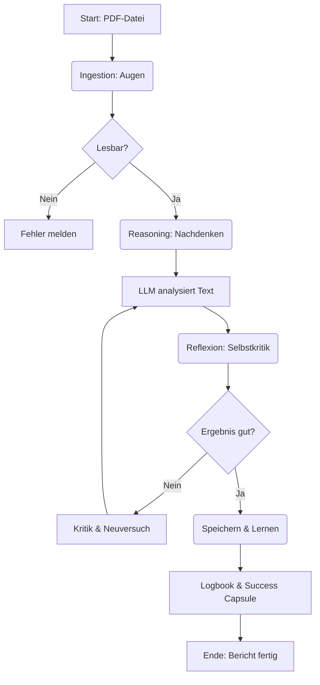

# Architektur-Guide für Einsteiger: Der Autonome Dokumentenanalyse-Agent

Willkommen! Dieses Dokument erklärt Ihnen, wie der von uns gebaute AI-Agent "unter der Haube" funktioniert. Es ist speziell für Einsteiger geschrieben, um die Konzepte hinter modernen AI-Agenten verständlich zu machen.

---

## 1. Was ist ein "Autonomer AI-Agent"?

Stellen Sie sich normale Software (wie Excel) als Werkzeug vor: Sie müssen jeden Schritt selbst klicken. 
Ein **AI-Agent** ist eher wie ein Mitarbeiter: Sie geben ihm ein Ziel ("Analysiere dieses Dokument"), und er erledigt die Schritte eigenständig. Er kann lesen, "denken", Entscheidungen treffen und sogar seine Fehler korrigieren.

Unser Agent ist **autonom**, weil er:
1.  Den Inhalt selbstständig versteht (via LLM).
2.  Seine Ergebnisse überprüft (Reflexion).
3.  Seinen eigenen Code anpassen kann, wenn er auf neue Probleme stößt (Evolution).
4.  Alles **lokal** auf Ihrem Computer läuft (Datenschutz!).

---

## 2. Die Kern-Komponenten (Der Körper des Agenten)

Man kann die Architektur mit dem menschlichen Körper vergleichen:

| Komponente | Analogie | Funktion im Agenten | Tech-Stack |
| :--- | :--- | :--- | :--- |
| **Agent Core** | **Gehirn/Zentrale** | Steuert alle anderen Teile. Entscheidet, was als nächstes passiert. | Node.js (TypeScript) |
| **Ingestion** | **Augen** | Liest Dokumente (PDFs) und wandelt sie in verständlichen Text um. | Python (`pdfplumber`) |
| **Reasoning** | **Gedanken** | Analysiert den Text, sucht nach Fehlern (Production Problems) und zieht Schlussfolgerungen. | LLM (Llama 3 via Ollama) |
| **Reflexion** | **Gewissen/Kritik** | Überprüft die eigenen Ergebnisse auf Logikfehler. "Habe ich das Format eingehalten?" | TypeScript (RegEx) |
| **Evolution** | **Hände/Lernen** | Schreibt den eigenen Code um, wenn ein neues Dokumentenformat nicht passt. | `CapabilityEvolver` |
| **Memory** | **Gedächtnis** | Speichert Ergebnisse langfristig ab. | ChromaDB & Dateien |

---

## 3. Der Ablauf: Vom PDF zur Analyse

Hier ist der Weg, den ein Dokument durch den Agenten nimmt:

### Schritt 1: Ingestion (Die Augen)
Der Agent nutzt ein **Python-Skript**, um PDFs zu lesen. Warum Python? Weil Python die besten Bibliotheken für Datenverarbeitung hat. Node.js ruft dieses Skript nur auf und bekommt den Text zurück.

### Schritt 2: Reasoning & Reflexion (Das Denken)
Hier passiert die Magie.
1.  **Actor:** Der Agent sendet den Text an das LLM (Llama 3) mit der Anweisung: "Finde alle Produktionsprobleme (PBIs)".
2.  **Evaluator:** Der Agent prüft die Antwort *ohne* KI, mit strengen Regeln (z.B. "Hat jedes PBI eine ID wie `PBI-12345`?").
3.  **Loop:** Wenn der Evaluator "Nein" sagt, gibt er das Feedback an den Actor zurück ("Du hast die ID vergessen, versuch es nochmal!"). Das wiederholt sich, bis das Ergebnis perfekt ist.

### Schritt 3: Evolution (Das Lernen)
Wenn der Agent auf ein Dokument stößt, das er *nicht* verarbeiten kann (z.B. ein komplett neues Layout), kann er in den **Evolution Mode** schalten.
Er bittet das LLM: "Schau dir meinen Code an und schau dir diesen Fehler an. Schreib mir eine bessere Version meines Codes."
Dann testet er den neuen Code gegen alte "Erfolgs-Kapseln" (Success Capsules), um sicherzugehen, dass er nichts Altes kaputt gemacht hat.

---

## 4. Die Technologien (Der Werkzeugkasten)

*   **Node.js / TypeScript:** Die Hauptsprache. Schnell, modern und typensicher (weniger Fehler).
*   **Ollama:** Ein Tool, um große Sprachmodelle (wie Llama 3) lokal auf Ihrem PC auszuführen. Es ersetzt die Cloud (OpenAI/Google).
*   **ChromaDB:** Eine "Vektor-Datenbank". Sie speichert nicht nur Text, sondern die *Bedeutung* von Text. So kann der Agent später fragen: "Hatten wir so ein Problem schon mal?" (Zukunftsmusik für Version 2).
*   **pdfplumber:** Eine Python-Bibliothek, die PDFs extrem präzise auslesen kann, besser als die meisten JavaScript-Alternativen.

---

## 5. Projektstruktur (Wo finde ich was?)

Das Projekt ist als **Monorepo** organisiert. Das bedeutet, alle Teile des Systems liegen in einem Hauptordner:

*   **`@Root`** (Hauptverzeichnis)
    *   `task.md` - Die aktuelle Aufgabenliste.
    *   `tests/` - Systemweite Tests & Beispieldateien (PDFs).
    *   `agent-core/` - **Der eigentliche Agent** (Das "Backend").

Innerhalb von **`agent-core/`** finden Sie:

*   `src/` - Der Quellcode (Source).
    *   `src/engine/` - Das Herzstück (`AgentCore`, `ReflexionEngine`).
    *   `src/skills/` - Die Fähigkeiten (PDF lesen, Analysieren, Lernen).
    *   `src/memory/` - Speicherfunktionen (ChromaDB).
*   `dist/` - Der *übersetzte* Code (JavaScript).
*   `doc/` - Dokumentation & ADRs.

---

## 6. Warum "Local-First"?

Moderne "Cloud-First" Software sendet Ihre Daten an Server von Google oder Microsoft.
Unser **Local-First** Ansatz bedeutet:
*   **Datenschutz:** Keine T2 Release Note verlässt je Ihren Rechner.
*   **Kosten:** Keine API-Gebühren für jeden Aufruf.
*   **Unabhängigkeit:** Läuft auch ohne Internet (sobald Modelle geladen sind).

---

Ich hoffe, dieser Guide hilft Ihnen, sich in der Welt der autonomen AI-Agenten zurechtzufinden! 🚀
